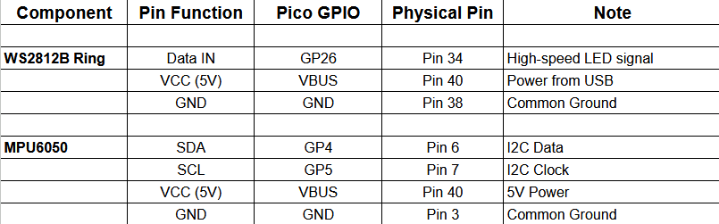
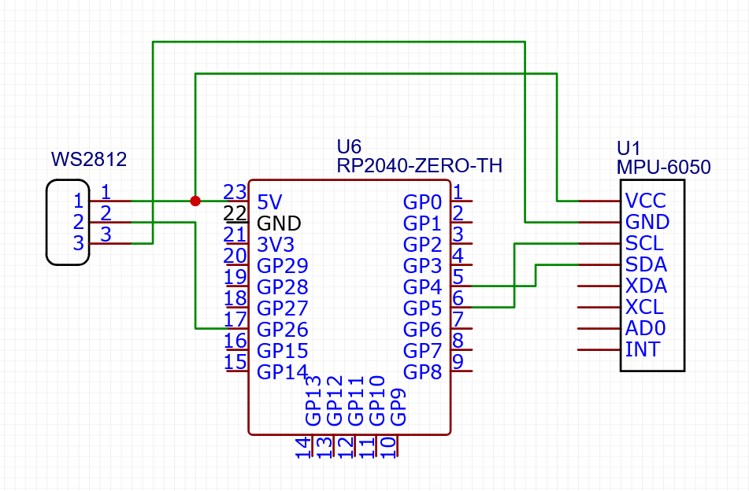
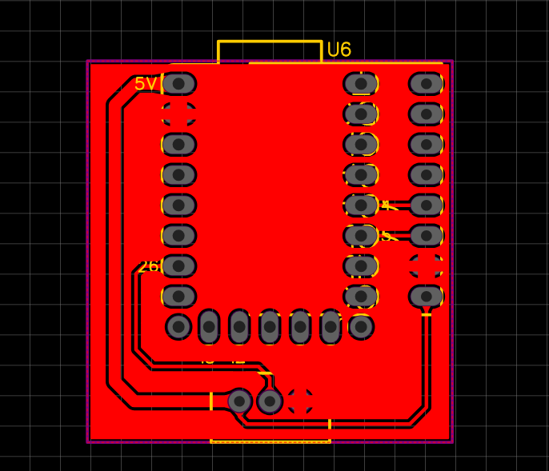
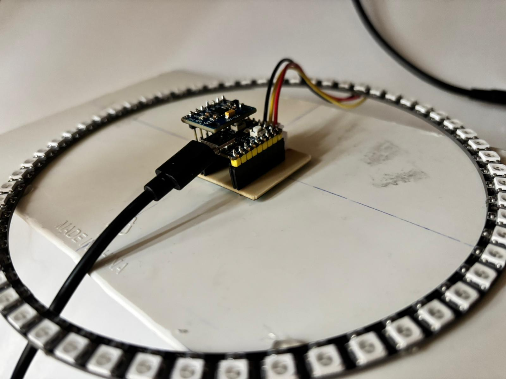
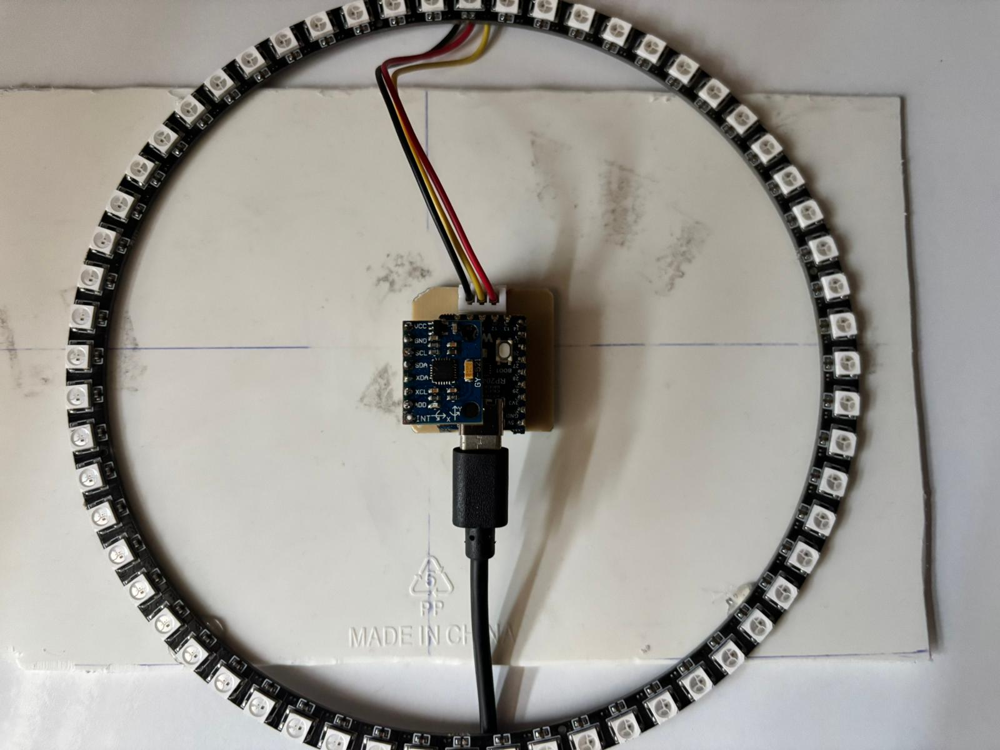

# Motion-Driven Light (Water Physics) - Pi Pico Dual Core

## Project Overview

This project is a virtual fluid physics engine running on a Raspberry Pi Pico. Using an MPU6050 sensor and a ring with 60 LEDs, it simulates an interactive “digital water balance” that responds in real time to the laws of physics (inertia, momentum, friction).

## Project Structure

The files included in the project are briefly described below.

- **motion-driven-light_Ring** **(MAIN PROJECT)**

Includes the latest firmware for the 60 LED Ring setup(2D Physics Engine). Run this file to test the project with the ring LED.

- **motion-driven-light**

First prototype (Linear physics logic). Recorded for version history. 8-LED flat neopixel tested.
-> https://youtube.com/shorts/M1EpC66oDy8?si=H--r2uOWxxHVKi08

- **motion-driven-light_SandSimulation**

Features inverted gravity logic, dynamic "splash" color effects, and real-time ASCII visualization. Configured for a 16-LED strip with 8-unit sand simulation
-> https://youtube.com/shorts/JNmV4SZPx7w?feature=share

- **mpu6050_pico_serial_test**

**Unit Test:** Used to verify I2C communication and raw data reading from the MPU6050 sensor before integration.

- **pico_ws2812_red_blink**

**Unit Test:** Used to verify power supply and signal integrity for the WS2812B LEDs on the Raspberry Pi Pico.

- **assets**

Contains documentation assets (Wiring diagrams, screenshots, etc.).

---

## Which Code Should I Run?

For the full experience described in this documentation, please use the code located in:
**`motion-driven-light_Ring/`**

**Why this version?**
Unlike the earlier prototypes, this version utilizes 2D Vector Math to simulate a 360-degree liquid surface and implements Signal Processing to smooth out sensor noise.

## Features

- **Dual-Core Architecture:**
  - Core 0: Handles I2C sensor reading, EMA (Exponential Moving Average) filtering, and physics calculations.
  - Core 1: Manages LED rendering and Serial communication to prevent timing bottlenecks.
- **Signal Processing:** Implements a software-based low-pass filter to eliminate sensor jitter, ensuring smooth liquid movement.
- **Realistic Physics:** Water does not stop instantly; it accelerates, decelerates, and flows according to gravity.
- **Dual-Core Architecture:** Physics calculations (Core 0) and LED visualization (Core 1) run simultaneously on separate cores for maximum performance.
- **Live Visuals:** The color of the water changes dynamically based on speed (Still Blue -> Moving Turquoise -> Foamy White).
- **Full Reliability:** The system automatically calibrates itself during startup. This ensures that the water remains perfectly stable on a flat surface, regardless of manufacturing defects in the sensor.Uses a statistical "Trimmed Mean" algorithm. It sorts 200 sensor readings and discards outliers (noise/spikes), calibrating only on the stable middle data to ensure a rock-solid zero point.
- **Robust Fail-Safe:** The system automatically detects if the sensor is missing and switches to a "Ghost Hand" simulation mode.

## Hardware Setup

The project uses a Raspberry Pi Pico as the main controller. Below is the pin mapping for the peripherals.

**Power Note:** The WS2812B LEDs require 5V (VBUS). Do not power them from the 3V3 pin, as it may damage the voltage regulator on the Pico when using high brightness.

 

## How to Test

You can verify the system's functionality and robustness using the following scenarios:

1. **Standard Operation & Calibration**

- Step 1: Place the Ring and Sensor on a flat, stable surface.

- Step 2: Power on the Pico via USB.

- Observation (Calibration): You will see an Orange Cross (+) blinking on the LED ring for exactly 2 seconds. Do not move the sensor during this phase.

- Observation (Ready): Once calibration is complete, the orange light turns off, and a Deep Blue point appears at the lowest gravity point.

- Action: Tilt the sensor in any direction (360°). The light should flow smoothly towards the lowest point, simulating liquid physics.

-> https://youtube.com/shorts/5EYqlaO_wfM?feature=share

2. **Visual Dynamics (The "Living Water" Effect)**

Action: Tilt the sensor gently vs. rapidly.

Observation:

- Still: The water in deep blue.
- Moving: The color shifts to Turquoise.
- Shaking: Shake the sensor vigorously. The water turns White, simulating foam/turbulence.

3. **Robustness Test (Fail-Safe Mode)**

Objective: To prove the system does not crash when hardware fails.

- Step 1: Unplug the Pico.

- Step 2: Disconnect the MPU6050 sensor completely (remove VCC/GND/SDA/SCL wires).

- Step 3: Power on the Pico.

- Observation: The system detects the sensor failure. Instead of crashing, it enters "Advanced Simulation Mode".

- Effect: A "Ghost Hand" algorithm takes over, generating complex wave patterns that simulate natural hand tremors and gravity shifts. The water continues to flow organically without any external input.

-> https://youtube.com/shorts/DG2Ya7dyYuo?feature=share

4. **Headless Testing (Serial Monitor)**

Even without the LED Ring, you can visualize the physics engine.

-Setup: Connect Pico to PC and open Arduino Serial Monitor.

    Settings: Baud Rate 115200.

    Output: The monitor displays the raw filtered sensor data (X, Y), the calculated velocity, and an ASCII visual of the ring:

        X: 120.5   Y: -45.2   Vel: 0.12    [      ~O~       ]  <-- Stationary
        X: -15.0   Y: 200.1   Vel: 1.50    [         ~O~    ]  <-- Moving Right
        X: 300.2   Y: 12.0    Vel: 4.20    [           =O=  ]  <-- High Speed

-> https://youtube.com/shorts/fzVaaSYen3E?feature=share
-> https://youtu.be/OTydAIbvoZM

## Dependencies

- Adafruit_NeoPixel
- MPU6050 (Electronic Cats)

 
